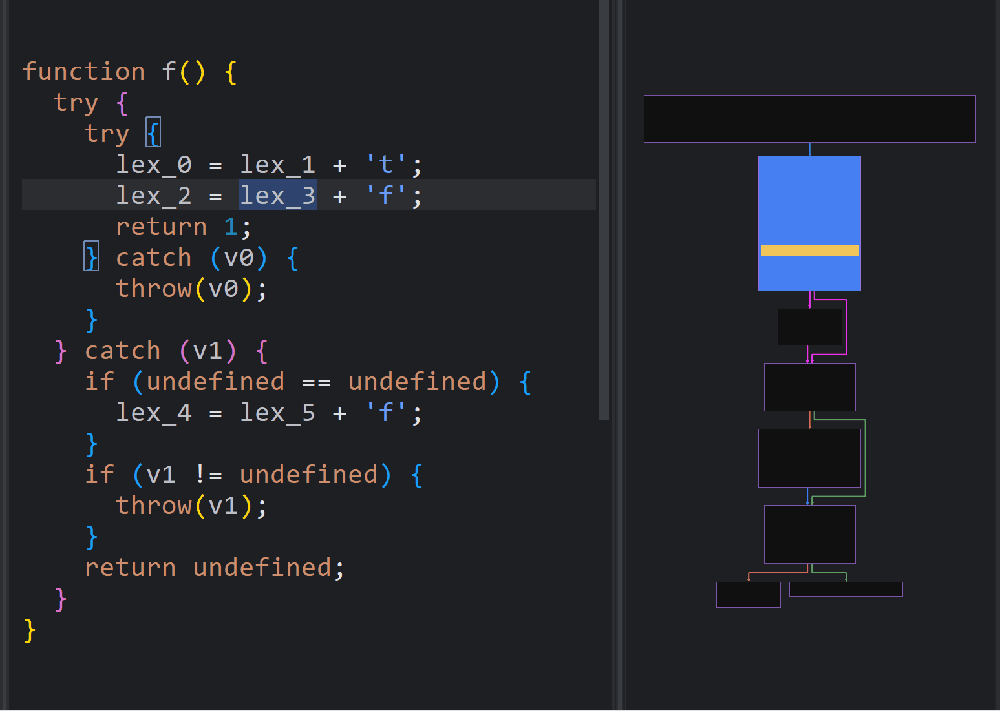
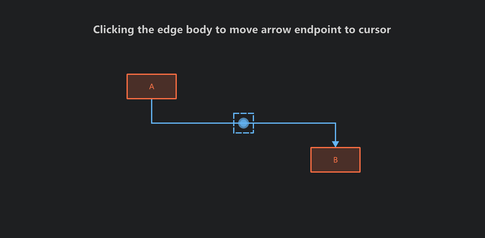
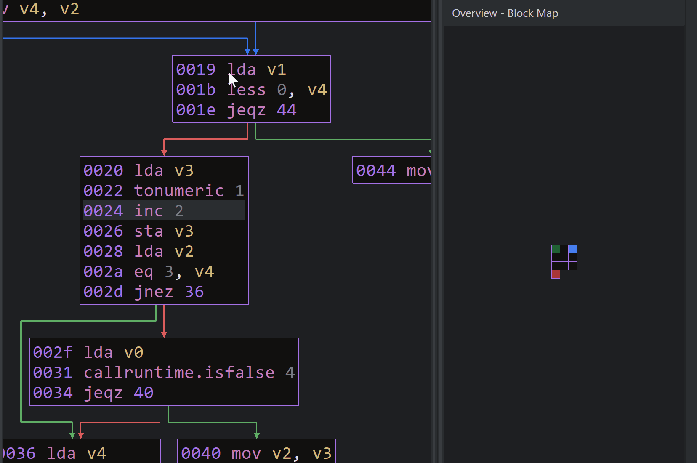
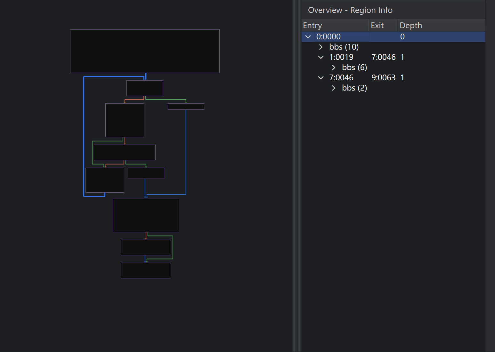
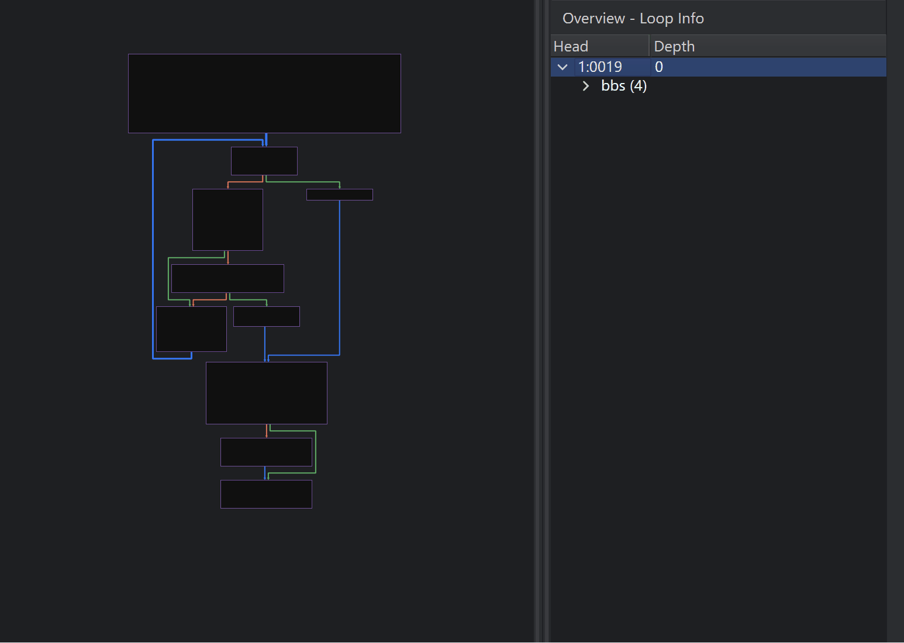

# binaryripper
Binary Ripper™ is a commercial decompiler for HarmonyOS Ark Bytecode. This repository releases the free, non-commercial edition and tracks public issues and bug reports. Commercial usage and licensing: sales@binaryripper.com.

[中文](README_zh.md)

## Key Features

### Flat Exception Structuring Mode
Separates **normal execution flow** from **exception handler flow**, allowing analysis to focus on the primary execution path.  
This improves readability and understanding of complex control flow involving exceptions.

  
<strong>Watch Demo</strong>

   
  

### Graph CFG Edge Interaction Mode
Provides a CFG edge interaction model for fast, deterministic bidirectional navigation between basic blocks.

- **Clicking the edge body**  to move arrow endpoint to cursor
- **Clicking the arrow head** to move opposite endpoint to cursor

  
<strong>Watch Demo</strong>

   
  

### Advanced Graph CFG Overview Modes

#### Loop Info
Displays **nested loop structure information**, including loop headers and loop members.

#### Region Info
Displays **nested SESE region structure information**, including region entry points, members, and exit points.

#### Block Navigation Map
Visualizes all **basic blocks** as individual **cells** in a **block map view**, allowing users to:
- Quickly locate a specific basic block
- Evaluate overall function size
- Assess the scale of loops and regions by highlighting their members.

  
<strong>Watch Demo</strong>

   
  

---

### Graph CFG Auto Grouping (Folding)
Supports folding selected **loops and regions** into a single node, reducing CFG complexity and improving graph readability.

  
<strong>Region Info & Folding</strong>

   
  

  
<strong>Loop Info & Folding</strong>

   
  

## Features Matrix

| Feature | Free |
|--------|:----:|
| Ark Bytecode Disassembly | ✓ |
| Ark Bytecode Decompilation | — |
| &nbsp;&nbsp;- Decompile Single Method | ✓ |
| &nbsp;&nbsp;- Decompile Entire Class | — |
| Interprocedural Lexical Variable Recovery | — |
| Exception Handler Structuring Modes | — |
| &nbsp;&nbsp;- Hierarchical Structuring | ✓ |
| &nbsp;&nbsp;- Flat Structuring | — |
| &nbsp;&nbsp;- Disable Exception Handling | — |
| Graph CFG View | — |
| &nbsp;&nbsp;- Edge Interaction Mode | ✓ |
| &nbsp;&nbsp;- Auto Grouping | — |
| Graph CFG Overview View | — |
| &nbsp;&nbsp;- Mini Graph | ✓ |
| &nbsp;&nbsp;- Loop Information | — |
| &nbsp;&nbsp;- Region Information | — |
| &nbsp;&nbsp;- Block Navigation Map | — |
| Disassembly & Pseudocode View Synchronization | — |

## Support & Contact

- **Bug reports and feature requests**: GitHub Issues or support@binaryripper.com
- **Commercial licensing and sales**: sales@binaryripper.com
- **Other inquiries**: contact@binaryripper.com

## Disclaimer

Binary Ripper is a **closed-source commercial product**, and this repository does **not** contain source code.
